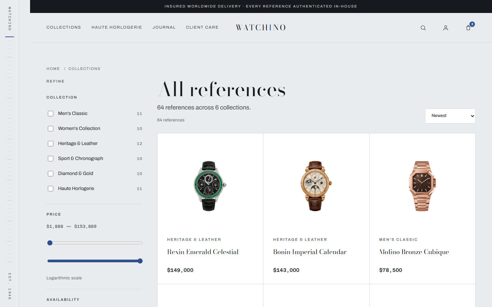
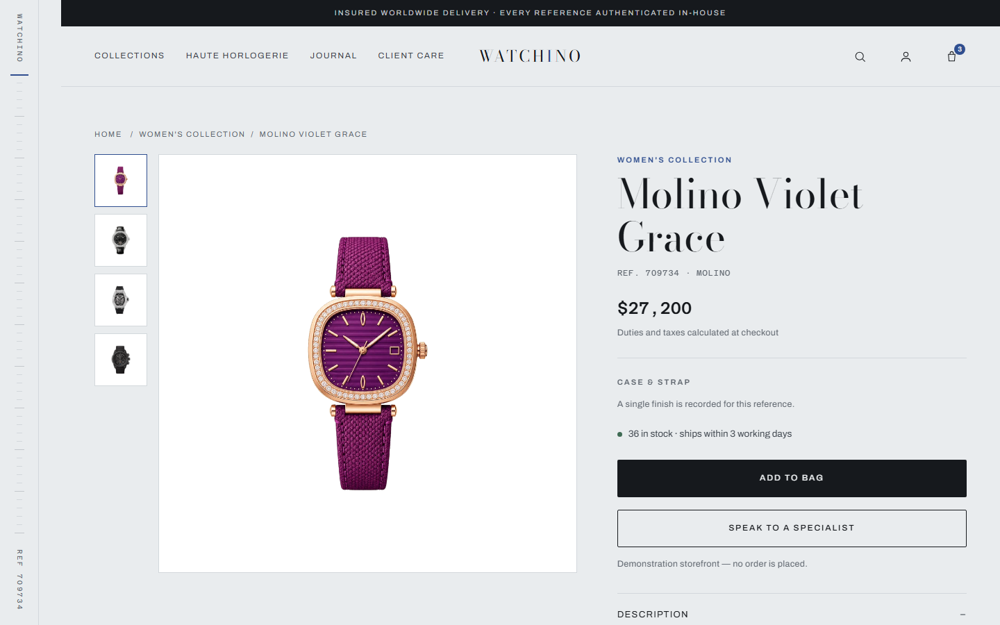
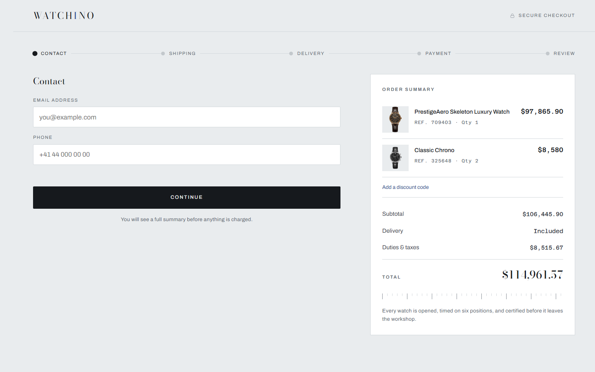
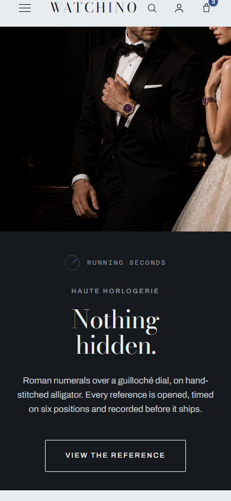

<div align="center">

# Watchino

**A luxury watch storefront built on Selldone.**
Static, framework-free, deployed on Cloudflare Workers.

[**Live site →**](https://watchino.selldone.shop)

</div>

> Architecture, OAuth flow, API boundaries and build plumbing live in [`docs/technical-reference.md`](docs/technical-reference.md).

---

## Before you deploy your own: customer sign-in needs a shop email

Direct customer sign-in only works once the shop owner has set an email address
under **Store dashboard → Settings → Email**. Until that is set, a customer who
taps *Sign in* is sent to Selldone to create an account **there** instead of
signing in to the shop itself. It is a shop-level setting, so a visitor cannot
change it and no amount of storefront code works around it.

This is the single most common surprise when cloning this repo, which is why the
storefront says so in the account panel rather than leaving you to discover it.
That amber callout is scaffolding for people evaluating the platform — **delete
it once your shop is configured.** It lives in one place, `SIGNIN_NOTE` in
[`storefront/app.js`](storefront/app.js).

On this demo shop the contact email *is* set (`info@watchino.com`) but no mail
service is configured, so the callout stays visible. See
[`SETUP.md`](SETUP.md) step 4 for both states.

---

## Design direction — "Blued Steel"

The visual language comes from horological instrumentation rather than from a generic luxury template. The accent is `#2F4E8F` — the colour steel turns at 290°C when a watchmaker blues a set of hands.

<div align="center">
  
  <br><em>Homepage — hero, six collections, three price registers, the salon section</em>
</div>

**What makes it specific:**

| | |
|---|---|
| **Surface** | `#E9ECEE` cool dial white — deliberately not warm cream |
| **Ink** | `#16191D` cool graphite — never pure black |
| **Accent** | `#2F4E8F` heat-blued steel |
| **Brass** | `#9A7B43` — Haute Horlogerie section only, nowhere else |
| **Display** | Bodoni Moda — Didone lettering, as printed on a watch dial |
| **Body** | Archivo |
| **Data** | Azeret Mono, tabular figures on every price |

**Signature element:** a vertical chapter-ring index rail down the left edge that doubles as scroll progress. Section dividers are minute markers, not plain rules — the page structure literally measures itself.

**Position:** a gallery, not a sales funnel. No countdown timers, no urgency banners, no "X people viewing", no discount popups. Reduced prices show as a struck-through previous figure in muted grey, and only on the product page — never as a badge on a card.

---

## The pages

<div align="center">
  
  <br><em>Shop — four filters, logarithmic price slider, 66 references</em>
</div>

<br>

<div align="center">
  
  <br><em>Product — works for every reference via <code>?id=</code></em>
</div>

<br>

<div align="center">
  
  <br><em>Checkout — five steps, stripped header, physical basket only</em>
</div>

<br>

<div align="center">
  
  <br><em>390px — the index rail hides below 1024, nav becomes a full-screen drawer</em>
</div>

---

## Two other directions were built

Both are in [`directions/`](directions/) and both run — open either file in a
browser, no build and no server. They read the same catalogue as the deployed
site and are proof that the shop's identity is a design decision rather than a
property of the platform.

Note that `design-reference/` is **not** either of them: it is an earlier
snapshot of the shipped Blued Steel direction, same graphite and dial palette.

| | |
|---|---|
| [**The Index**](directions/index.html) | Swiss systematic, c. 1970. Inter Tight only, no serif. One signal colour, `#D8341C`. Everything numbered; collections render as a table, not a card grid. A toggle exposes the real 12-column grid. |
| [**Night Vitrine**](directions/night-vitrine.html) | The boutique after closing. Fully dark, warm blacks, light as the only accent. Every product sits in its own pool of light. Adds reviews, a journal, and a three-boutique section. |

---

## Stack

No framework, no build step beyond copying files, **zero runtime dependencies**.

```
storefront/   →  /              the customer storefront
dashboard/    →  /dashboard/    browser-side admin
callback/     →  /callback/     OAuth PKCE landing
shared/       →  shared browser modules
scripts/      →  build-static.mjs · dev-static.mjs · build-pages.mjs
                 audit-run.mjs · imgsweep.mjs · pagecheck.mjs · deadctl.mjs
                 herocheck.mjs
store-pages/  →  Markdown source for the four content pages
dist/         →  build output (not committed)
```

**Data** comes browser-direct from `https://xapi.selldone.com`. The customer storefront never calls `api.selldone.com` — that boundary is enforced and audited.

**Auth** is Authorization Code + PKCE (S256) against `selldone.com/oauth`, public client, no secret. The Stripe publishable key is read at runtime from shop gateway info and appears in no file.

---

## Running it

```bash
npm install                 # dev tooling only — wrangler and playwright
npm run dev:static          # http://localhost:8788/
npm run build:static        # → dist/
```

### Checking it

The assertions this README makes are executable. Once per machine, fetch the browser they drive — `npm install` does not, because nothing else in the repo needs it:

```bash
npx playwright install chromium
```

Then, with the dev server running:

```bash
npm run check               # all of them
```

| | |
|---|---|
| `check:audit` | 10 checks × 10 pages × 11 widths, 1440 → 390 |
| `check:images` | no image escapes its content box; declared `aspect-ratio` actually renders |
| `check:pages` | every footer link resolves to content that is **not** the homepage |
| `check:controls` | no button or link without a handler or destination |
| `check:hero` | both wrists stay in frame at 1440/1280/1024, and no scrim was added |

Each takes an optional base URL, so the same checks run against a deployment:
`node scripts/pagecheck.mjs https://watchino.selldone.shop`.

Deploys happen automatically: **Cloudflare Workers Builds** is connected to this repo and publishes on every push to `main`. Non-production branches get a preview URL via `wrangler versions upload`.

---

## The catalogue

66 physical references, six collections, six maker names, USD.

| Collection | Refs | From |
|---|---|---|
| Men's Classic | 12 | $3,950 |
| Women's Collection | 11 | $4,690 |
| Heritage & Leather | 12 | $5,350 |
| Sport & Chronograph | 10 | $2,088.90 |
| Diamond & Gold | 10 | $6,598.90 |
| Haute Horlogerie | 11 | $65,778.90 |

The price range spans $2,089 to $153,889. A **linear** slider would put 29 of the 66 references — 44% of the catalogue — inside its first eighth, so the shop filter uses a **logarithmic** track: its midpoint lands at $17,929 rather than $77,989. The bounds are computed from the live catalogue, not written down, so they follow the shop as it grows.

Counts on the site are read from the catalogue at runtime for the same reason. The numbers in this table are the only place they are written by hand.

---

## Things worth knowing before you change anything

**No invented data.** Product reviews are driven by real ratings, which are currently zero across the whole catalogue, so the block shows an honest empty state. Specifications come from the real `spec` field. There are no fabricated calibers, reviewers, or colour names anywhere.

**Images are contained, not cropped.** Every image sits inside its box via `object-fit: contain`, and `scripts/imgsweep.mjs` asserts it — both that no image overflows its container's content box, and that any element declaring `aspect-ratio` actually renders at it. That second assertion exists because the first one alone missed a real bug where the container itself had stretched.

**Reveal-on-scroll fails visible.** Twelve sections animate in, but they default to `opacity: 1`; the animation lives behind a `js-reveal` class added only at the moment the observer arms. If JavaScript throws, the page is still readable.

**Colour is never the only indicator.** Variant swatches carry the hex value as an accessible label plus a visible "Finish 2 of 3" ordinal. Composite variants like `#7B1FA2/#D32F2F` render as a 135° split gradient — as a raw `background-color` they are invalid CSS and render white.

**Audited across 11 widths**, 1440 down to 390, including the 800–1000 band where a real hero-overlap bug was hiding between the obvious breakpoints.

---

## Default page content

`store-pages/` holds ready-made About Us, Terms, Privacy and Contact copy, with `{{PLACEHOLDER}}` tokens. Each carries a visible demo-content banner that **must be removed before a real shop goes live**.

The Markdown is the source. `npm run build:pages` renders it into `storefront/about-us.html`, `terms.html`, `privacy.html` and `contact-us.html`, filling the tokens and reusing `index.html`'s header and footer — so edit the Markdown, not the HTML.

They are pages on this Worker rather than links to Selldone-hosted ones because `not_found_handling = "single-page-application"` answers **200 with the homepage** for any path that has no asset. Linking `/about-us` before the file existed looked like it worked. `npm run check:pages` compares each response against the homepage for exactly that reason.

The Terms and Privacy templates are a starting point, not legal advice, and need review against the jurisdiction they will be used in.

---

<div align="center">
<sub>Demonstration storefront. No order is ever placed.</sub>
</div>
